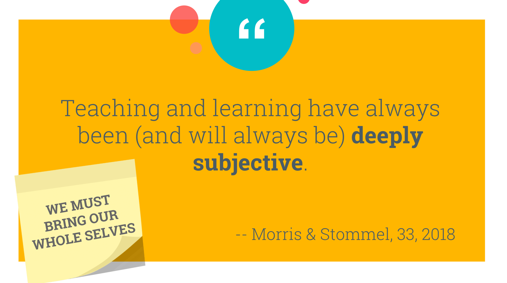

> The following is an adaptation of the notes for my CLAPS 2018 presentation. <a href="../dl/Design Thinking in an Hour (Notes).pdf" download="DT in an Hour - Notes">Link to notes</a>. <a href="../dl/Design Thinking in an Hour (Slides).pdf" download="DT in an Hour - Slides">Link to slides</a>. 

### Part 1
In my short time as a library worker and in higher education, I have noticed one thing: there are a lot of popular, innovative “things” that promise a lot but don’t always end up delivering. Overall, I can see why such “things” are popular and why they are adopted in many situations. However, I still wonder what is happening in some places that we are willing to ignore clear warning signs. Is it lack of information, pressure from higher ups, or is it just desperation? I’m sure we could dedicate a whole session, or a whole conference to talk about “trends” or “innovations,” but that’s not what I want to talk about today. However, I do want to ask you, why do you think those “new things” and “innovations” so often fail at delivering what they promised?

One trend that is currently being discussed around higher education, libraries, and beyond, is Design Thinking. Design Thinking, according to the company (yes, the company) that it comes from, is a process for creative problem solving. But in reality, the definition of Design Thinking is highly contested.

At this point, it is impossible for me to say whether or not Design Thinking will live up to its promise of innovation. But the more I see it show up in conferences, publications, or in social media, the more I keep asking myself: why are people using it? That’s why I wanted to do this presentation. I wanted to understand what makes Design Thinking so special. I wanted to know why people are using it. Plus, I wanted to see if I could use it in my practice, because in the end, I want my work to be the best that it can be.

I first encountered Design Thinking about two years ago. However, as I learned more about it, I realized that I had been engaged in some form of it at my last place of work as part of campus wide initiative. In retrospect, I was entirely content with that process and, for the most part, I was pleased with the results. But after digging a little deeper into what had taken place before I joined that organization and then as that initiative unfolded and I learned more about Design Thinking, I kept wondering if the steps taken would actually lead to anything good. This wasn’t an attempt to be cynical about the process (which I wasn’t too happy about), but out of curiosity and concern for what was being done, what was going to come out of all the conversations that we’d had, and most of all, who was going to benefit.

But before I get too far ahead of myself, I want to spend some time talking about what people are saying about Design Thinking. To do so, I want to start by highlight an article I encountered last year. This article has gotten a lot of negative feedback (not just because of the title) but because the article is a one-sided critique of what Design Thinking is and does. In fact, it ends by calling one of Design Thinking’s main advocates a stand-up comedian and calls Design Thinking and what he does a comedic routine.

I have read this article more times than I’m willing to admit, and to this date, the last part of it is still unsettling. Even if I agree with everything Vinsel is saying, I would hesitate to recommend this article to people (at least at first). It is one thing to talk badly about those things we don’t agree with, but it is another to totally decontextualize it. As readers closer to Burnett have commented to the author himself, Design Thinking is their reality and to portray it this way may in fact defeat the whole purpose of his argument: to expose Design Thinking as an unreliable approach to problem solving.

This article is just one of many trying to really dig into what Design Thinking is and explain what it means to those who use it. Each of these articles takes a different approach, but for the most part, they agree that, though Design Thinking is pitched as a framework for getting things done, it only cares about finding simple solutions to problems that often go under analyzed. Still, to appeal to those who already know about the design process, Design Thinking provides a set of steps that outline its process.

But if I’m to talk about this process, I have to digress a bit, and tell you a story from the past. In my senior year of high school, I was learning about derivatives in Calculus class. I really loved that class, but there was one thing I did not like: how my teacher taught us to derive functions. To refresh your memory, this is what you have to do to derive a function. But you can also do it THIS way. To this date, I still remember how that reveal felt, but then again, as a Scorpio, it’s hard for me to let go of things like that. How is this example relevant, you may ask? 

Regardless of what I have said so far, Design Thinking does something good: simplify the design process. Design Thinking has made the design process so easy to understand that if I were to tell someone about the design process, I may be tempted to use these steps as a starting point. Again, these steps are not entirely bad, but in plain terms, you could write them out like this (adapted from Vinsel 2017): try to understand your audience, come up with a plan, try it out, evaluate it, and try again as necessary. It really cannot get simpler than that, and that is one of the reasons why Design Thinking has become so popular. It promises solutions that are achieved through a simple process that anyone can follow. But at what cost, I wonder?

Take for example, the one case that many critics talk about, the PlayPump. This device was a merry-go round that was designed to pump water out of wells. However, it wasn’t always effective and was sometimes abandoned because, within the community that it was introduced, there was no previous tradition of playing with merry-go rounds.

Now, if you are at all familiar with instructional design, you should have found a couple of the previous slides familiar. Essentially, Design Thinking is presenting itself under the guise of something else. Earlier, I mentioned that if I wanted to tell someone about the design process, I may be tempted to use the Design Thinking process as a starting point. However, I wouldn’t stop there. I would then continue to talk about instructional design and even the ADDIE model.

To give you some context, the ADDIE model, which has been around since the 1970s, has been adopted and modified by anyone from marketers to educators, but Design Thinking appears to be adopting its practices and erasing the expertise of those who it is trying to impersonate: Designers. In a sense, Design Thinking is devaluing the work designers do. As such, I will not talk much about what designers say about Design Thinking. Instead, I’ll let you see it and hear it yourselves.

Whether it was the session description, or the title of the presentation, or what I have just said, I’m pretty sure you have figured out by now that I’m not in favor of Design Thinking. However, to simply dismiss it would be irresponsible. So now, we get to the part where I tell you what this session is really about. I’m not here to say bad things about Design Thinking (I already did that) or to say why you should not use it (these designers have already spoken about that). I’m here to talk about the implications of Design Thinking in libraries if library workers continue to employ it in their practice.

### Part 2
To give myself some time to breathe, I want to ask you another question: Where have you seen Design Thinking show up in libraries? What were the issues trying to be solved? If you are not familiar with Design Thinking, what impression do you have so far from hearing me talk about it?

As far as I can tell, Design Thinking started to be talked about in libraries as early as 2007, but it may have appeared earlier under other names. Since my goal wasn’t to put together a comprehensive lit review (at least at this point), I stuck to a surface level analysis. What I found was that the number of workshops, publications, and conferences with a Design Thinking-focus started to increase around 2015, after IDEO, the COMPANY behind Design Thinking, released their Design Thinking for Libraries toolkit, which they developed after spending a couple years collaborating side by side with librarians and learning about their contexts.

Now, if we extend this out a little further and compare Google searches for “design thinking” and “academic libraries,” there is a clear point around 2015 where Design Thinking begins to appear in more searches. The same does not happen if you compare it to libraries in general, but it still holds up if you compare Design Thinking and Information Literacy. These trends don’t really paint an accurate picture, but from them, we can tell that a many people are interested in learning about Design Thinking.

Within our profession, there is already information about Design Thinking coming from ALA, IFLA, library schools, and library publishers, and I imagine that this trend will continue to grow as more and more library workers are exposed to this concept. For the most part, the searches and literature review I’ve done indicate that these publications and conferences pitch Design Thinking as a way to tackle the usual library problems through a user-centric perspective. Others, like this presentation, are still trying to figure out how Design Thinking fits (or not) into what we do. And then, there are those who talk about Design Thinking as an innovative approach to doing library work. Either way, Design Thinking is now a thing in library land. People are talking about it in journals, conferences and within their institutions. But whether or not we agree with Design Thinking and its practices, I say that we still need to pay attention and learn about it. Which brings me to #critlib and the work that is happening in that area.

To talk about #critlib, I want to call attention to my favorite definition of critical information literacy, provided by Annie Downey: CIL is in a sense an expanded version of Information Literacy that places the learner at the center in a more empowered role  …  It is very concerned with the power relationships that impact information production and dissemination and tries to move Information Literacy beyond the purely mechanical and technical … (Downey 173)

I like this definition because it paints a very complicated picture. One where neither the student nor the teacher has “the answer.” One where no solution is the right solution. One where all approaches are possible, whether they lead to success or failure. This matters because, at its core, #critlib is about learner agency. Design Thinking, on the other hand, pursues empathy at a surface level and focuses on finding solutions to problems. Transferred to an educational settings, the ideals behind Design Thinking would imply that all students are the same, that they all have the same needs, and that they all learn the same way. But reality is far removed from that. Our students have diverse needs, and they come to us with different backgrounds and experiences, and they’ll continue to become more diverse. 

#critlib and those that engage in it are doing work that examine the role that these diverse experiences bring to the classroom. At the same time, #critlib acknowledges the positionality that exists in learning, as well as teaching, as it invites both the learner and the instructor to participate as equals in the learning process. Design Thinking, on the other hand, goes into a situation assuming that there is a solution before the problem is even considered. And even though it calls for empathy, Design Thinking still continues to place the power on the designer who makes decisions without thinking about their position in relation to the problems they are trying to solve (Iskander paraphrase). This lack of positionality is harmful and isolates the designer from the problem. Can you imagine what a classroom would look like under these conditions? For many of us, unfortunately, this is not hard to do. Everyday, we hear about instances where students are seen as a problem to be fixed and not as the people that they are.

As Jesse Stommel says, “teaching is subjective” (UoT 33), and as such, it requires us to be present. It requires us to bring our whole selves to the classroom, the good and the bad. So that together with our students, we can learn from each other and transform how we perceive our world and our roles in it.

At this point, in a similar presentation, the speaker would give you an alternative that they believe best addresses the shortcoming of the thing they have just argued against. However, I’m not going to do that. Not because I don’t have an alternative, but because it is not as simple as that. In fact, I’d be doing the same thing that Design Thinking is doing. But the fact remains that the work the we do is not simple, the people that we work with are not simple, and the places that we work in are not simple. With that in mind, what I can give you, however, is a starting point from which you can make sense of your work, the people you work with, and your work environment while still acknowledging that my experiences are what is driving this exploration and that there may be certain things that I won’t be able to answer, but that we can still talk about after this session.

To do this, I’m going to retrace my steps to the CIL definition I mentioned earlier. Within this definition, I was able to find three points that I believe provide a counter argument to the message that Design Thinking is trying to send. Others have already spoken and written more eloquently about these topics, and this is my attempt to join that conversation. I mention this because even if I’m not going to directly quote anyone, I don’t want to do the same thing that Design Thinking is doing and appropriate their work and call it my own. Instead, I wish to elevate their work and upon it, build new ground from which you can contribute to this work that is so important to us.

First of all, I want to talk about learner empowerment. This type of work is carried out in several ways, but those that practice #critlib engage in it more effectively when they dismantle power dynamics within their teaching. I have already mentioned instructional design and its relation to Design Thinking, but I want to extend this further by highlighting the work that Sean Michael Morris and Jesse Stommel are doing.

In particular, I want to talk about their work related to critical instructional design (CID). Critical Instructional Design is an early attempt to move away from positivist learning experiences and toward more equitable learning opportunities and practices. This is relevant because practices like Design Thinking that are centered around practitioners will often favor a majority, while Critical Instructional Design tries to equalize power within those interactions. But to be honest, there is still a lot of work to be done in order to make Critical Instructional Design a reality or even something that people can get behind, but the work that Morris and Stommel are doing in relation to digital pedagogy is an attempt to pave the way for what will come.

Since I’ve been in higher ed, either as a student or a professional, technology has been the thing people seem to always be talking about, and if this trend continues, I imagine that we’ll be talking more and more about online learning. Critical Instructional Design is trying to get ahead of this change. It is an attempt to use critical pedagogies, translate them, or even transform them to the online environment. It is also an attempt to tear down power dynamics even when our students are thousands of miles away. But ultimately, it wants to show that we first need to get better at teaching our students face to face before we move to the online realm.

To talk about the next thing, employing a learner centered pedagogy, I want to present two scenarios taken from an essay written by Natasha Iskander for the Harvard Business Review about Design Thinking and the status quo. In the fallout of Hurricane Sandy, the Obama administration launched an initiative to find creative solutions to help reconstruct the infrastructure that was destroyed then, prepare for the imminent bigger storms, and plan for the changes that climate change will bring to the area. To do so, they sent out an initiative that brought together designers from around the world. 

A big part of the prize was awarded to a project titled “the Big U,” which is a ten-mile segmented wall (YES, A WALL) meant to protect the lower half of Manhattan. However, as Iskander points out, this wall will become useless in 30 or so years as estimates predict storms surges will by then surpass those of Sandy. But that’s not the most alarming part. Once this wall has outlived its usefulness, any flooding that may occur in that area will have nowhere to go. Oh, and the first phases of construction are projected to take place in the Lower East Side of Manhattan, where the last remaining affordable housing in the area can be found.

Compare this to another design, titled the Living Breakwaters, which is a proposal meant to create small islands along the south shore of Staten Island. These man-made islands, which are for the most part made from piles of rubble, are intended to revive marine ecologies and to “provide a physical and symbolic platform for educational and economic engagement with the ecosystem.” Their goal (quoting Iskander), “rather than create a wall between people and water,” is to embrace the water and increases awareness of risk. So far, the team behind this proposal has kept the design process open and envisions that the breakwaters will be reinvented as the seas around them continue to rise. This process will require input from designers, the community, and even the life forms that make the breakwaters their home.

Now, I ask you think about these two solutions and translate them into a classroom context. For the wall example, image a syllabus or a lesson plan that is used consistently across many classes or sessions and does not change regardless of how students themselves change. For the other example, image a syllabus or lesson plan that tries to look into the future, but acknowledges that futility, and instead focuses on periodic and cumulative improvements based on the needs of students or the institution. I hope that through these examples, you can see why centering our teaching around the learner is a better choice. Rather than create walls that may prevent students from reaching their full potential, it is our responsibility as teachers to open up our practice and let students contribute to the learning process.

And last, I want to highlight the importance of re-examining and defining our teaching practice. If we do not question the teaching choices we make or take a moment to connect them to learning theory or the larger needs of our students and organizations, we are doing the same thing that Design Thinking is doing, which is empathize at a surface level.

What I’m arguing here is that any change to our teaching practice should be informed by our students and the environment in which we work. To do so, we must first understand our practice and know what are the theories and principles behind it. Being able to explain one’s teacher identity, approach to teaching, and pedagogical goals enables teaching librarians to develop a practice that is constantly adapting to best meet the needs of their community. Once made clear, the ways in which we teach, and not WHAT we teach, can become a method of advocacy for the work that we do and for our students.

### Part 3
With this, we come to the last part of my presentation. As I prepped and researched for this talk, I wondered about what approach to take, to the point where I put off working on this part for longer than I should have. But as I re-read everything I had collected over the past several months on Design Thinking,  one article felt particularly relevant.

In this article, Irani argues that Design Thinking is part of the system that is trying to keep expertise and ingenuity in the West by elevating the value of creative work. She does so by tracing Design Thinking’s origin to the time when Chinese companies caught up to those in the West and began to offer the same services as them. Essentially, she is saying that Design Thinking’s practices and ideals uphold “hierarchies of race and economic practice” that economic nationalism has used to “mobilize people in the name of whiteness and economy.” In short, and echoing Iskander’s argument, Design Thinking enforces the status quo rather than innovate.

Now, translate that into the library profession, and I don’t think I have to say much more. Consider the current demographics in our profession and consider the demographics of the places we work in, then consider the shifting demographics of the students that we serve. 

Now, I want to ask the same question Jeff Chang, author of “Can’t Stop, Won’t Stop,” asked at the Race and Pedagogy Conference back in September: “2042 is the year all goes to hell. What will you do to prepare?”

2042 is the estimated year when people of color will become the majority in the US. Now, whenever that day comes, be it sooner or later, if we think that our library classroom is too far removed from that. Then we are taking the wrong approach. After all, the work that we do if we really mean it, is meant to transform the way students perceive themselves within the world they live in. Now, I understand that change at the institutional or professional level requires more than just a few adjustments and time, but that’s time that many of our students simply do not have.
 
Earlier, I asked you to think about why certain trends fail. Now, I ask that you reflect on the answers you had then based on what I have just presented. If you have worked in academia for just a few years, you know how hard change can be to implement, and you know how easy it is to fall into the same old patterns. Most of all, you know the prevalence of conversations around the value of our work. But as we sit here in this conference talking about critical pedagogy, I want to ask you to consider the history of the methods that you employ in your teaching and to reflect on what they are trying to achieve.

But more importantly, I want to ask you to consider your workplace, your organization, and your students, that’s where you’ll find the next big thing. It is not by asking them what they need, but by working alongside them to figure out a way forward. That, I say, is design thinking. 

### What I Cited and/or Recommend Reading
+ [ACRL. (2018). Keeping Up With… Design Thinking.](http://www.ala.org/acrl/publications/keeping_up_with/design)
+ [Bogost, Ian. (2016). Who Needs Convertible Slippers?](https://www.theatlantic.com/technology/archive/2016/07/who-needs-convertible-slippers/490520/)
+ [Downey, Annie. (2016). Critical information literacy: Foundations, inspiration, and ideas.](http://libraryjuicepress.com/downey.php)
+ [Gardner, Lee. (2017). Can Design Thinking Redesign Higher Ed?](https://www.chronicle.com/article/Can-Design-Thinking-Redesign/241126)
+ [IDEO. (2015). Design Thinking for Libraries Toolkit.](http://designthinkingforlibraries.com/)
+ [Irani, Lilly. (2018). “Design Thinking”: Defending Silicon Valley at the Apex of Global Labor Hierarchies. Catalyst: Feminism, Theory, Technoscience, 4(1).](https://catalystjournal.org/index.php/catalyst/article/view/29638/html)
+ [Iskander, Natasha. (2018). Design Thinking Is Fundamentally Conservative and Preserves the Status Quo. Harvard Business Review.](https://hbr.org/2018/09/design-thinking-is-fundamentally-conservative-and-preserves-the-status-quo)
+ [Jen, Natasha. (2017). Design Thinking Is Bullsh*t.](https://99u.adobe.com/videos/55967/natasha-jen-design-thinking-is-bullshit)
+ [Morris, Sean Michael. (2018). Instructional Designers Are Teachers.](http://hybridpedagogy.org/instructional-designers-are-teachers/)
+ [Morris, Sean Michel, & Stommel, Jesse. (2018). An Urgency of Teachers.](https://urgencyofteachers.com/)
+ [Seitz, Tim. (2018). The “Design Thinking” Delusion.](https://www.jacobinmag.com/2018/10/design-thinking-innovation-consulting-politics)
+ [Vinsel, Lee. (2017). Design Thinking is Kind of Like Syphilis — It’s Contagious and Rots Your Brains.](https://medium.com/@sts_news/design-thinking-is-kind-of-like-syphilis-its-contagious-and-rots-your-brains-842ed078af29)
+ [Vinsel, Lee. (2018). Design Thinking Is a Boondoggle.](https://www.chronicle.com/article/Design-Thinking-Is-a/243472)
+ [Vinsel, Lee. (2018). There’s So Little There There: A Response to the Stanford d.school’s Defense of Design Thinking](https://blog.usejournal.com/theres-so-little-there-there-a-response-to-the-stanford-d-school-s-defense-of-design-thinking-3cac35a1a365)
